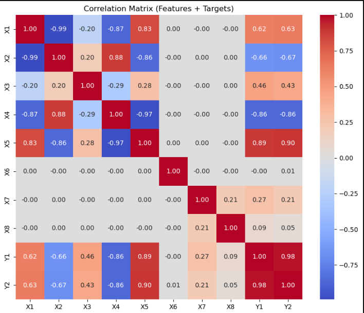
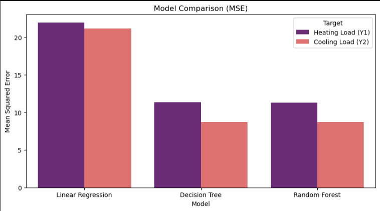
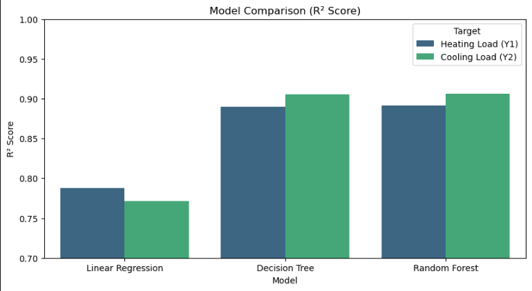

# Predicting building's heating and cooling loads with ML
## Project overview
When we build a batiment, we have someting that very important. It is the load of the building. To be carefull about it, we are going to make a predictive model that estimates the heating load and the cooling load of a building based on its physical and structural features.
## Business understanding
The energy of a building is as really important as others parts of a building construction. For that we are going to make an accurate load predictions can support energy-efficient building design, reduce energy costs, and help meet sustainability standards.

This project leverages **recommendations systems** to build a reliable predictive system that can build a reliable predictive system, Support architects and engineers in selecting optimal design configurations before construction, reduce energy consumption by recommending efficient design parameters, encourage sustainable development and support green building certification goals.
## Data Understanding
Regarding like this system can be helpfull, it was necessery to get data to help it true. We used the [Energy Efficiency Dataset](https://archive.ics.uci.edu/dataset/242/energy+efficiency) commonly available on the UCI Machine Learning Repository. This dataset bases on several architectural and design-related parameters.

## Data preparation
Before training any machine learning models, the dataset was carefully prepared to ensure data quality, consistency, and optimal model performance.  
The following preprocessing steps were applied:
- Data Loading and Inspection
- Feature Selection
- Encoding Categorical Variables
- Data Splitting
- Separate targets were kept for heating load and cooling load
## Data analisis
We made some EDA on the data to know about relevant features, to know about features that significantly correllate, to features that have almost not correlation, etc...

## Modeling
We used 3 models(linear regression, decision tree, random forest) to see which between them gemeralize well. For knowing that we must use metrics like r_square and mean square error(MSE)...

Here is the metrics for random forest. The model that generalize better.
Heating Load (Y1):
MSE = 11.37836604869241
R² = 0.8902871328418207

Cooling Load (Y2):
MSE = 8.741029898401292
R² = 0.905673941598345

## visualization


## Conclusion

The developed model shows that machine learning can effectively predict building energy loads using only geometric and material features.  
This can significantly **support architects, engineers, and energy planners** by providing:
- Fast and reliable predictions of heating and cooling needs.  
- Insights into which design elements most impact energy consumption.  
- A foundation for **energy-efficient building design and optimization**.

In summary, the model successfully learns how design choices influence energy demand, providing a **data-driven approach** to sustainable architecture.

## 🗂️ Repository Structure

```bash
phase-4-project/
├── data/          # dataset for the case study
│   ├── ...
│   ├── ...
│   └── ...
├── images/        # images used
│   ├── ...
│   ├── ...
│   └── ...
├── pdf/          # pdf files 
│   ├── ...       # notebook.pdf
│   ├── ...       # github.pdf
│   └── ...       # presentation.pdf         
├── .gitignore
├── LICENSE
├── README.md    
└── index.ipynb           
```
